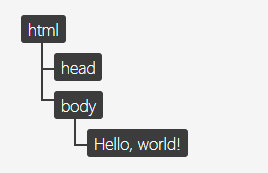
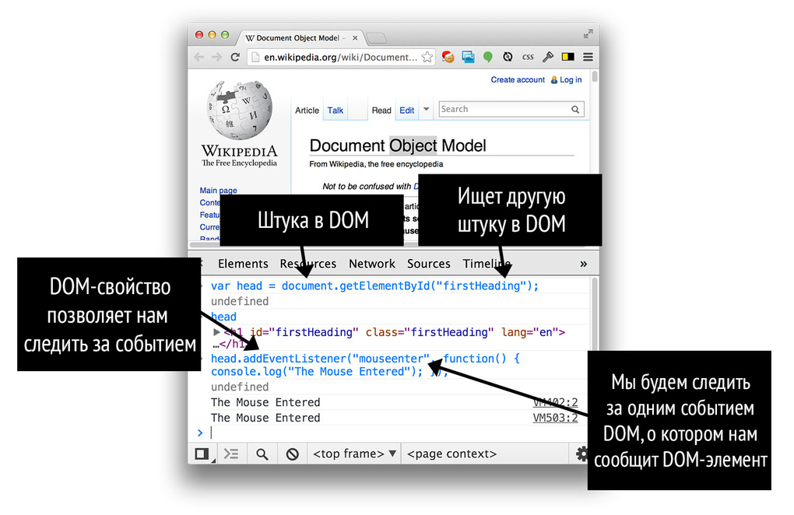

# JSON

```javascript
{ "Books":
  [
    { "ISBN":"ISBN-0-13-713526-2",
      "Price":85,
      "Edition":3,
      "Title":"A First Course in Database Systems",
      "Authors":[ {"First_Name":"Jeffrey", "Last_Name":"Ullman"},
                  {"First_Name":"Jennifer", "Last_Name":"Widom"} ] }
    ,
    { "ISBN":"ISBN-0-13-815504-6",
      "Price":100,
      "Remark":"Buy this book bundled with 'A First Course' - a great deal!",
      "Title":"Database Systems:The Complete Book",
      "Authors":[ {"First_Name":"Hector", "Last_Name":"Garcia-Molina"},
                  {"First_Name":"Jeffrey", "Last_Name":"Ullman"},
                  {"First_Name":"Jennifer", "Last_Name":"Widom"} ] }
  ],
  "Magazines":
  [
    { "Title":"National Geographic",
      "Month":"January",
      "Year":2009 }
    ,
    { "Title":"Newsweek",
      "Month":"February",
      "Year":2009 }
  ]
}

```

-   [Спецификация](https://www.json.org/json-ru.html)
-   [Specification](https://www.json.org/json-en.html)


# XML

```xml
<!--Bookstore with no DTD-->

<Bookstore>
   <Book ISBN="ISBN-0-13-713526-2" Price="85" Edition="3rd">
      <Title>A First Course in Database Systems</Title>
      <Authors>
         <Author>
            <First_Name>Jeffrey</First_Name>
            <Last_Name>Ullman</Last_Name>
         </Author>
         <Author>
            <First_Name>Jennifer</First_Name>
            <Last_Name>Widom</Last_Name>
         </Author>
      </Authors>
   </Book>
   <Book ISBN="ISBN-0-13-815504-6" Price="100">
      <Remark>
      Buy this book bundled with "A First Course" - a great deal!
      </Remark>
      <Title>Database Systems: The Complete Book</Title>
      <Authors>
         <Author>
            <First_Name>Hector</First_Name>
            <Last_Name>Garcia-Molina</Last_Name>
         </Author>
         <Author>
            <First_Name>Jeffrey</First_Name>
            <Last_Name>Ullman</Last_Name>
         </Author>
         <Author>
            <First_Name>Jennifer</First_Name>
            <Last_Name>Widom</Last_Name>
         </Author>
      </Authors>
   </Book>
</Bookstore>
```


# XML + XSL

```xml
<xsl:stylesheet version="1.0" xmlns:xsl="http://www.w3.org/1999/XSL/Transform">
    <xsl:template match="/">
        <html>
            <body>
                <h2> My Books collection</h2>
                <table border="1">
                    <tr bgcolor="red">
                        <th align="left">title</th>
                        <th align="left">author</th>
                    </tr>
                    <xsl:for-each select="/Bookstore/Book">
                        <tr>
                            <td><xsl:value-of select="Title"/></td>
                            <xsl:choose>
                                <xsl:when test="@Price > 90">
                                    <td bgcolor="yellow"><xsl:value-of select="Authors/Author"/></td>
                                </xsl:when>
                                <xsl:when test="@Price > 30">
                                    <td bgcolor="lightgreen"><xsl:value-of select="Authors/Author"/></td>
                                </xsl:when>
                                <xsl:otherwise>
                                    <td bgcolor="gray"><xsl:value-of select="Authors/Author"/></td>
                                </xsl:otherwise>
                            </xsl:choose>
                        </tr>
                    </xsl:for-each>
                </table>
            </body>
        </html>
    </xsl:template>
</xsl:stylesheet>
```

```shell
xsltproc Bookstore.xsl BookstoreQ.xml
```

<html><body>
<h2> My Books collection</h2>
<table border="1">
<tr bgcolor="red">
<th align="left">title</th>
<th align="left">author</th>
</tr>
<tr>
<td>A First Course in Database Systems</td>
<td bgcolor="lightgreen">
            Jeffrey
            Ullman
         </td>
</tr>
<tr>
<td>Database Systems: The Complete Book</td>
<td bgcolor="yellow">
            Hector
            Garcia-Molina
         </td>
</tr>
<tr>
<td>Hector and Jeff's Database Hints</td>
<td bgcolor="lightgreen">
            Jeffrey
            Ullman
         </td>
</tr>
<tr>
<td>Jennifer's Economical Database Hints</td>
<td bgcolor="gray">
            Jennifer
            Widom
         </td>
</tr>
</table>
</body></html>


# XML + DTD

```xml
<?xml version="1.0" ?>

<!DOCTYPE Bookstore [
   <!ELEMENT Bookstore (Book | Magazine)*>
   <!ELEMENT Book (Title, Authors, Remark?)>
   <!ATTLIST Book ISBN CDATA #REQUIRED
                  Price CDATA #REQUIRED
                  Edition CDATA #IMPLIED>
   <!ELEMENT Magazine (Title)>
   <!ATTLIST Magazine Month CDATA #REQUIRED Year CDATA #REQUIRED>
   <!ELEMENT Title (#PCDATA)>
   <!ELEMENT Authors (Author+)>
   <!ELEMENT Remark (#PCDATA)>
   <!ELEMENT Author (First_Name, Last_Name)>
   <!ELEMENT First_Name (#PCDATA)>
   <!ELEMENT Last_Name (#PCDATA)>
]>

<Bookstore>
   <Book ISBN="ISBN-0-13-713526-2" Price="85" Edition="3rd">
      <Title>A First Course in Database Systems</Title>
      <Authors>
         <Author>
            <First_Name>Jeffrey</First_Name>
            <Last_Name>Ullman</Last_Name>
         </Author>
         <Author>
            <First_Name>Jennifer</First_Name>
            <Last_Name>Widom</Last_Name>
         </Author>
      </Authors>
   </Book>
   <Book ISBN="ISBN-0-13-815504-6" Price="100">
      <Title>Database Systems: The Complete Book</Title>
      <Authors>
         <Author>
            <First_Name>Hector</First_Name>
            <Last_Name>Garcia-Molina</Last_Name>
         </Author>
         <Author>
            <First_Name>Jeffrey</First_Name>
            <Last_Name>Ullman</Last_Name>
         </Author>
         <Author>
            <First_Name>Jennifer</First_Name>
            <Last_Name>Widom</Last_Name>
         </Author>
      </Authors>
      <Remark>
         Buy this book bundled with "A First Course" - a great deal!
      </Remark>
   </Book>
</Bookstore>
```

```shell
apt install libxml2-utils
xmllint --valid --noout Bookstore-DTD.xml
xmllint --valid --noout Bookstore-IDREFs.xml
```


# HTML

| DTD                                                                                                                | Описание                                                                                         |
|------------------------------------------------------------------------------------------------------------------ |------------------------------------------------------------------------------------------------ |
| <!DOCTYPE HTML PUBLIC  "-//W3C//DTD HTML 4.01//EN" "www.w3.org/TR/html4/strict.dtd">                               | Строгий синтаксис HTML.                                                                          |
| <!DOCTYPE HTML PUBLIC  "-//W3C//DTD HTML 4.01 Transitional//EN" "www.w3.org/TR/html4/loose.dtd">                   | Переходный синтаксис HTML.                                                                       |
| <!DOCTYPE HTML PUBLIC  "-//W3C//DTD HTML 4.01 Frameset//EN" "www.w3.org/TR/html4/frameset.dtd">                    | В HTML-документе применяются фреймы.                                                             |
| <!DOCTYPE html PUBLIC  "-//W3C//DTD XHTML 1.0 Strict//EN" "www.w3.org/TR/xhtml1/DTD/xhtml1-strict.dtd">            | Строгий синтаксис XHTML.                                                                         |
| <!DOCTYPE html PUBLIC "-//W3C//DTD XHTML 1.0 Transitional//EN" "www.w3.org/TR/xhtml1/DTD/xhtml1-transitional.dtd"> | Переходный синтаксис XHTML.                                                                      |
| <!DOCTYPE html PUBLIC  "-//W3C//DTD XHTML 1.0 Frameset//EN" "www.w3.org/TR/xhtml1/DTD/xhtml1-frameset.dtd">        | Документ написан на XHTML и содержит фреймы.                                                     |
| <!DOCTYPE html PUBLIC "-//W3C//DTD XHTML 1.1//EN" "www.w3.org/TR/xhtml11/DTD/xhtml11.dtd">                         | Никакого деления на виды это определение не имеет, синтаксис один и подчиняется четким правилам. |
| <!DOCTYPE html>                                                                                                    | HTML5                                                                                            |

```html
<!DOCTYPE html>
<html>
  <head>
    <meta charset="UTF-8"/>
  </head>
  <body>

    <h1>My First Heading</h1>
    <p>My first paragraph.</p>

  </body>
</html>
```


# XML + XSD

```xml
<?xml version="1.0" ?>
<!-- XSD for Bookstore-XSD.xml -->

<xsd:schema xmlns:xsd="http://www.w3.org/2001/XMLSchema">
   <xsd:element name="Bookstore">
      <xsd:complexType>
         <xsd:sequence>
            <xsd:element name="Book" type="BookType"
                         minOccurs="0" maxOccurs="unbounded" />
            <xsd:element name="Author" type="AuthorType"
                         minOccurs="0" maxOccurs="unbounded" />
         </xsd:sequence>
      </xsd:complexType>
      <xsd:key name="BookKey">
         <xsd:selector xpath="Book" />
         <xsd:field xpath="@ISBN" />
      </xsd:key>
      <xsd:key name="AuthorKey">
         <xsd:selector xpath="Author" />
         <xsd:field xpath="@Ident" />
      </xsd:key>
      <xsd:keyref name="AuthorKeyRef" refer="AuthorKey">
         <xsd:selector xpath="Book/Authors/Auth" />
         <xsd:field xpath="@authIdent" />
      </xsd:keyref>
      <xsd:keyref name="BookKeyRef" refer="BookKey">
         <xsd:selector xpath="Book/Remark/BookRef" />
         <xsd:field xpath="@book" />
      </xsd:keyref>
   </xsd:element>
   <xsd:complexType name="BookType">
      <xsd:sequence>
         <xsd:element name="Title" type="xsd:string" />
         <xsd:element name="Authors">
            <xsd:complexType>
               <xsd:sequence>
                  <xsd:element name="Auth" maxOccurs="unbounded">
                     <xsd:complexType>
                        <xsd:attribute name="authIdent" type="xsd:string"
                                       use="required" />
                     </xsd:complexType>
                  </xsd:element>
               </xsd:sequence>
            </xsd:complexType>
         </xsd:element>
         <xsd:element name="Remark" minOccurs="0">
            <xsd:complexType mixed="true">
               <xsd:sequence>
                  <xsd:element name="BookRef" minOccurs="0"
                               maxOccurs="unbounded">
                     <xsd:complexType>
                        <xsd:attribute name="book" type="xsd:string"
                                       use="required" />
                     </xsd:complexType>
                  </xsd:element>
               </xsd:sequence>
            </xsd:complexType>
         </xsd:element>
      </xsd:sequence>
      <xsd:attribute name="ISBN" type="xsd:string" use="required" />
      <xsd:attribute name="Price" type="xsd:integer" use="required" />
   </xsd:complexType>
   <xsd:complexType name="AuthorType">
      <xsd:sequence>
         <xsd:element name="First_Name" type="xsd:string" />
         <xsd:element name="Last_Name" type="xsd:string" />
      </xsd:sequence>
      <xsd:attribute name="Ident" type="xsd:string" use="required" />
   </xsd:complexType>
</xsd:schema>

```

```shell
xmllint --schema Bookstore.xsd Bookstore-XSD.xml
```


# JSON Schema

```shell
pip install json-spec
json validate --schema-file BookstoreSchema.json --document-file Bookstore.json
```


# DOM

```html
<!doctype html>
<html>
  Hello, world!
</html>
```

  

```javascript
var newParagraph = document.createElement("p");
var paragraphContent = document.createTextNode("I'm new!");
newParagraph.appendChild(paragraphContent);
document.body.appendChild(newParagraph);
```

  

```python
from xml.dom.minidom import parse

dom = parse("BookstoreQ.xml")
for book in dom.getElementsByTagName("Book"):
    print(book.getAttribute("ISBN"))
```

    - ISBN-0-13-713526-2
    - ISBN-0-13-815504-6
    - ISBN-0-11-222222-3
    - ISBN-9-88-777777-6


# SAX

```python
from xml.sax import parse
from xml.sax.handler import ContentHandler

class MyHandler(ContentHandler):

    def startElement(self, name, attrs):
        print(f"BEGIN: <{name}>, {attrs.keys()}")

    def endElement(self, name):
        print(f"END: </{name}>")

    def characters(self, content):
        if content.strip() != "":
            print("CONTENT:", repr(content))

dom = parse("BookstoreQ.xml", MyHandler())
```

```
- BEGIN: <Bookstore>, []
- BEGIN: <Book>, ['ISBN', 'Price', 'Edition']
- BEGIN: <Title>, []
- CONTENT: 'A First Course in Database Systems'
- END: </Title>
- BEGIN: <Authors>, []
- BEGIN: <Author>, []
- BEGIN: <First_Name>, []
- CONTENT: 'Jeffrey'
- END: </First_Name>
- BEGIN: <Last_Name>, []
- CONTENT: 'Ullman'
- END: </Last_Name>
- END: </Author>
- BEGIN: <Author>, []
- BEGIN: <First_Name>, []
- CONTENT: 'Jennifer'
- END: </First_Name>
- BEGIN: <Last_Name>, []
- CONTENT: 'Widom'
- END: </Last_Name>
- END: </Author>
- END: </Authors>
- END: </Book>
- BEGIN: <Book>, ['ISBN', 'Price']
- BEGIN: <Title>, []
- CONTENT: 'Database Systems: The Complete Book'
- END: </Title>
- BEGIN: <Authors>, []
- BEGIN: <Author>, []
- BEGIN: <First_Name>, []
- CONTENT: 'Hector'
- END: </First_Name>
- BEGIN: <Last_Name>, []
- CONTENT: 'Garcia-Molina'
- END: </Last_Name>
- END: </Author>
- BEGIN: <Author>, []
- BEGIN: <First_Name>, []
- CONTENT: 'Jeffrey'
- END: </First_Name>
- BEGIN: <Last_Name>, []
- CONTENT: 'Ullman'
- END: </Last_Name>
- END: </Author>
- BEGIN: <Author>, []
- BEGIN: <First_Name>, []
- CONTENT: 'Jennifer'
- END: </First_Name>
- BEGIN: <Last_Name>, []
- CONTENT: 'Widom'
- END: </Last_Name>
- END: </Author>
- END: </Authors>
- BEGIN: <Remark>, []
- CONTENT: '         Buy this book bundled with "A First Course" - a great deal!'
- END: </Remark>
- END: </Book>
- BEGIN: <Book>, ['ISBN', 'Price']
- BEGIN: <Title>, []
- CONTENT: "Hector and Jeff's Database Hints"
- END: </Title>
- BEGIN: <Authors>, []
- BEGIN: <Author>, []
- BEGIN: <First_Name>, []
- CONTENT: 'Jeffrey'
- END: </First_Name>
- BEGIN: <Last_Name>, []
- CONTENT: 'Ullman'
- END: </Last_Name>
- END: </Author>
- BEGIN: <Author>, []
- BEGIN: <First_Name>, []
- CONTENT: 'Hector'
- END: </First_Name>
- BEGIN: <Last_Name>, []
- CONTENT: 'Garcia-Molina'
- END: </Last_Name>
- END: </Author>
- END: </Authors>
- BEGIN: <Remark>, []
- CONTENT: 'An indispensible companion to your textbook'
- END: </Remark>
- END: </Book>
- BEGIN: <Book>, ['ISBN', 'Price']
- BEGIN: <Title>, []
- CONTENT: "Jennifer's Economical Database Hints"
- END: </Title>
- BEGIN: <Authors>, []
- BEGIN: <Author>, []
- BEGIN: <First_Name>, []
- CONTENT: 'Jennifer'
- END: </First_Name>
- BEGIN: <Last_Name>, []
- CONTENT: 'Widom'
- END: </Last_Name>
- END: </Author>
- END: </Authors>
- END: </Book>
- BEGIN: <Magazine>, ['Month', 'Year']
- BEGIN: <Title>, []
- CONTENT: 'National Geographic'
- END: </Title>
- END: </Magazine>
- BEGIN: <Magazine>, ['Month', 'Year']
- BEGIN: <Title>, []
- CONTENT: 'National Geographic'
- END: </Title>
- END: </Magazine>
- BEGIN: <Magazine>, ['Month', 'Year']
- BEGIN: <Title>, []
- CONTENT: 'Newsweek'
- END: </Title>
- END: </Magazine>
- BEGIN: <Magazine>, ['Month', 'Year']
- BEGIN: <Title>, []
- CONTENT: "Hector and Jeff's Database Hints"
- END: </Title>
- END: </Magazine>
- END: </Bookstore>
```

```python
from xml.dom.pulldom import parse
event_stream = parse("BookstoreQ.xml")
for event, node in event_stream:
    print(event, node)
```

```
- START_DOCUMENT <xml.dom.minidom.Document object at 0x7fd87e271fa0>
- START_ELEMENT <DOM Element: Bookstore at 0x7fd87ea921f0>
- CHARACTERS <DOM Text node "'\n'">
- CHARACTERS <DOM Text node "'   '">
- START_ELEMENT <DOM Element: Book at 0x7fd87e1b8940>
- CHARACTERS <DOM Text node "'\n'">
- CHARACTERS <DOM Text node "'      '">
- START_ELEMENT <DOM Element: Title at 0x7fd87e1b8af0>
- CHARACTERS <DOM Text node "'A First Co'...">
- END_ELEMENT <DOM Element: Title at 0x7fd87e1b8af0>
- CHARACTERS <DOM Text node "'\n'">
- CHARACTERS <DOM Text node "'      '">
- START_ELEMENT <DOM Element: Authors at 0x7fd87e1b8e50>
- CHARACTERS <DOM Text node "'\n'">
- CHARACTERS <DOM Text node "'         '">
- START_ELEMENT <DOM Element: Author at 0x7fd87e178dc0>
- CHARACTERS <DOM Text node "'\n'">
- CHARACTERS <DOM Text node "'          '...">
- START_ELEMENT <DOM Element: First_Name at 0x7fd87e178e50>
- CHARACTERS <DOM Text node "'Jeffrey'">
- END_ELEMENT <DOM Element: First_Name at 0x7fd87e178e50>
- CHARACTERS <DOM Text node "'\n'">
- CHARACTERS <DOM Text node "'          '...">
- START_ELEMENT <DOM Element: Last_Name at 0x7fd87e178ee0>
- CHARACTERS <DOM Text node "'Ullman'">
- END_ELEMENT <DOM Element: Last_Name at 0x7fd87e178ee0>
- CHARACTERS <DOM Text node "'\n'">
- CHARACTERS <DOM Text node "'         '">
- END_ELEMENT <DOM Element: Author at 0x7fd87e178dc0>
- CHARACTERS <DOM Text node "'\n'">
- CHARACTERS <DOM Text node "'         '">
- START_ELEMENT <DOM Element: Author at 0x7fd87e178f70>
- CHARACTERS <DOM Text node "'\n'">
- CHARACTERS <DOM Text node "'          '...">
- START_ELEMENT <DOM Element: First_Name at 0x7fd87e179040>
- CHARACTERS <DOM Text node "'Jennifer'">
- END_ELEMENT <DOM Element: First_Name at 0x7fd87e179040>
- CHARACTERS <DOM Text node "'\n'">
- CHARACTERS <DOM Text node "'          '...">
- START_ELEMENT <DOM Element: Last_Name at 0x7fd87e1790d0>
- CHARACTERS <DOM Text node "'Widom'">
- END_ELEMENT <DOM Element: Last_Name at 0x7fd87e1790d0>
- CHARACTERS <DOM Text node "'\n'">
- CHARACTERS <DOM Text node "'         '">
- END_ELEMENT <DOM Element: Author at 0x7fd87e178f70>
- CHARACTERS <DOM Text node "'\n'">
- CHARACTERS <DOM Text node "'      '">
- END_ELEMENT <DOM Element: Authors at 0x7fd87e1b8e50>
- CHARACTERS <DOM Text node "'\n'">
- CHARACTERS <DOM Text node "'   '">
- END_ELEMENT <DOM Element: Book at 0x7fd87e1b8940>
- CHARACTERS <DOM Text node "'\n'">
- CHARACTERS <DOM Text node "'   '">
- START_ELEMENT <DOM Element: Book at 0x7fd87e179160>
- CHARACTERS <DOM Text node "'\n'">
- CHARACTERS <DOM Text node "'      '">
- START_ELEMENT <DOM Element: Title at 0x7fd87e1791f0>
- CHARACTERS <DOM Text node "'Database S'...">
- END_ELEMENT <DOM Element: Title at 0x7fd87e1791f0>
- CHARACTERS <DOM Text node "'\n'">
- CHARACTERS <DOM Text node "'      '">
- START_ELEMENT <DOM Element: Authors at 0x7fd87e179280>
- CHARACTERS <DOM Text node "'\n'">
- CHARACTERS <DOM Text node "'         '">
- START_ELEMENT <DOM Element: Author at 0x7fd87e179310>
- CHARACTERS <DOM Text node "'\n'">
- CHARACTERS <DOM Text node "'          '...">
- START_ELEMENT <DOM Element: First_Name at 0x7fd87e1793a0>
- CHARACTERS <DOM Text node "'Hector'">
- END_ELEMENT <DOM Element: First_Name at 0x7fd87e1793a0>
- CHARACTERS <DOM Text node "'\n'">
- CHARACTERS <DOM Text node "'          '...">
- START_ELEMENT <DOM Element: Last_Name at 0x7fd87e179430>
- CHARACTERS <DOM Text node "'Garcia-Mol'...">
- END_ELEMENT <DOM Element: Last_Name at 0x7fd87e179430>
- CHARACTERS <DOM Text node "'\n'">
- CHARACTERS <DOM Text node "'         '">
- END_ELEMENT <DOM Element: Author at 0x7fd87e179310>
- CHARACTERS <DOM Text node "'\n'">
- CHARACTERS <DOM Text node "'         '">
- START_ELEMENT <DOM Element: Author at 0x7fd87e1794c0>
- CHARACTERS <DOM Text node "'\n'">
- CHARACTERS <DOM Text node "'          '...">
- START_ELEMENT <DOM Element: First_Name at 0x7fd87e179550>
- CHARACTERS <DOM Text node "'Jeffrey'">
- END_ELEMENT <DOM Element: First_Name at 0x7fd87e179550>
- CHARACTERS <DOM Text node "'\n'">
- CHARACTERS <DOM Text node "'          '...">
- START_ELEMENT <DOM Element: Last_Name at 0x7fd87e1795e0>
- CHARACTERS <DOM Text node "'Ullman'">
- END_ELEMENT <DOM Element: Last_Name at 0x7fd87e1795e0>
- CHARACTERS <DOM Text node "'\n'">
- CHARACTERS <DOM Text node "'         '">
- END_ELEMENT <DOM Element: Author at 0x7fd87e1794c0>
- CHARACTERS <DOM Text node "'\n'">
- CHARACTERS <DOM Text node "'         '">
- START_ELEMENT <DOM Element: Author at 0x7fd87e179670>
- CHARACTERS <DOM Text node "'\n'">
- CHARACTERS <DOM Text node "'          '...">
- START_ELEMENT <DOM Element: First_Name at 0x7fd87e179700>
- CHARACTERS <DOM Text node "'Jennifer'">
- END_ELEMENT <DOM Element: First_Name at 0x7fd87e179700>
- CHARACTERS <DOM Text node "'\n'">
- CHARACTERS <DOM Text node "'          '...">
- START_ELEMENT <DOM Element: Last_Name at 0x7fd87e179790>
- CHARACTERS <DOM Text node "'Widom'">
- END_ELEMENT <DOM Element: Last_Name at 0x7fd87e179790>
- CHARACTERS <DOM Text node "'\n'">
- CHARACTERS <DOM Text node "'         '">
- END_ELEMENT <DOM Element: Author at 0x7fd87e179670>
- CHARACTERS <DOM Text node "'\n'">
- CHARACTERS <DOM Text node "'      '">
- END_ELEMENT <DOM Element: Authors at 0x7fd87e179280>
- CHARACTERS <DOM Text node "'\n'">
- CHARACTERS <DOM Text node "'      '">
- START_ELEMENT <DOM Element: Remark at 0x7fd87e179820>
- CHARACTERS <DOM Text node "'\n'">
- CHARACTERS <DOM Text node "'         B'...">
- CHARACTERS <DOM Text node "'\n'">
- CHARACTERS <DOM Text node "'      '">
- END_ELEMENT <DOM Element: Remark at 0x7fd87e179820>
- CHARACTERS <DOM Text node "'\n'">
- CHARACTERS <DOM Text node "'   '">
- END_ELEMENT <DOM Element: Book at 0x7fd87e179160>
- CHARACTERS <DOM Text node "'\n'">
- CHARACTERS <DOM Text node "'   '">
- START_ELEMENT <DOM Element: Book at 0x7fd87e1798b0>
- CHARACTERS <DOM Text node "'\n'">
- CHARACTERS <DOM Text node "'      '">
- START_ELEMENT <DOM Element: Title at 0x7fd87e179940>
- CHARACTERS <DOM Text node "'Hector and'...">
- END_ELEMENT <DOM Element: Title at 0x7fd87e179940>
- CHARACTERS <DOM Text node "'\n'">
- CHARACTERS <DOM Text node "'      '">
- START_ELEMENT <DOM Element: Authors at 0x7fd87e1799d0>
- CHARACTERS <DOM Text node "'\n'">
- CHARACTERS <DOM Text node "'         '">
- START_ELEMENT <DOM Element: Author at 0x7fd87e179a60>
- CHARACTERS <DOM Text node "'\n'">
- CHARACTERS <DOM Text node "'          '...">
- START_ELEMENT <DOM Element: First_Name at 0x7fd87e179af0>
- CHARACTERS <DOM Text node "'Jeffrey'">
- END_ELEMENT <DOM Element: First_Name at 0x7fd87e179af0>
- CHARACTERS <DOM Text node "'\n'">
- CHARACTERS <DOM Text node "'          '...">
- START_ELEMENT <DOM Element: Last_Name at 0x7fd87e179b80>
- CHARACTERS <DOM Text node "'Ullman'">
- END_ELEMENT <DOM Element: Last_Name at 0x7fd87e179b80>
- CHARACTERS <DOM Text node "'\n'">
- CHARACTERS <DOM Text node "'         '">
- END_ELEMENT <DOM Element: Author at 0x7fd87e179a60>
- CHARACTERS <DOM Text node "'\n'">
- CHARACTERS <DOM Text node "'         '">
- START_ELEMENT <DOM Element: Author at 0x7fd87e179c10>
- CHARACTERS <DOM Text node "'\n'">
- CHARACTERS <DOM Text node "'          '...">
- START_ELEMENT <DOM Element: First_Name at 0x7fd87e179ca0>
- CHARACTERS <DOM Text node "'Hector'">
- END_ELEMENT <DOM Element: First_Name at 0x7fd87e179ca0>
- CHARACTERS <DOM Text node "'\n'">
- CHARACTERS <DOM Text node "'          '...">
- START_ELEMENT <DOM Element: Last_Name at 0x7fd87e179d30>
- CHARACTERS <DOM Text node "'Garcia-Mol'...">
- END_ELEMENT <DOM Element: Last_Name at 0x7fd87e179d30>
- CHARACTERS <DOM Text node "'\n'">
- CHARACTERS <DOM Text node "'         '">
- END_ELEMENT <DOM Element: Author at 0x7fd87e179c10>
- CHARACTERS <DOM Text node "'\n'">
- CHARACTERS <DOM Text node "'      '">
- END_ELEMENT <DOM Element: Authors at 0x7fd87e1799d0>
- CHARACTERS <DOM Text node "'\n'">
- CHARACTERS <DOM Text node "'      '">
- START_ELEMENT <DOM Element: Remark at 0x7fd87e179dc0>
- CHARACTERS <DOM Text node "'An indispe'...">
- END_ELEMENT <DOM Element: Remark at 0x7fd87e179dc0>
- CHARACTERS <DOM Text node "'\n'">
- CHARACTERS <DOM Text node "'   '">
- END_ELEMENT <DOM Element: Book at 0x7fd87e1798b0>
- CHARACTERS <DOM Text node "'\n'">
- CHARACTERS <DOM Text node "'   '">
- START_ELEMENT <DOM Element: Book at 0x7fd87e179e50>
- CHARACTERS <DOM Text node "'\n'">
- CHARACTERS <DOM Text node "'      '">
- START_ELEMENT <DOM Element: Title at 0x7fd87e179ee0>
- CHARACTERS <DOM Text node ""Jennifer's"...">
- END_ELEMENT <DOM Element: Title at 0x7fd87e179ee0>
- CHARACTERS <DOM Text node "'\n'">
- CHARACTERS <DOM Text node "'      '">
- START_ELEMENT <DOM Element: Authors at 0x7fd87e179f70>
- CHARACTERS <DOM Text node "'\n'">
- CHARACTERS <DOM Text node "'         '">
- START_ELEMENT <DOM Element: Author at 0x7fd87e185040>
- CHARACTERS <DOM Text node "'\n'">
- CHARACTERS <DOM Text node "'          '...">
- START_ELEMENT <DOM Element: First_Name at 0x7fd87e1850d0>
- CHARACTERS <DOM Text node "'Jennifer'">
- END_ELEMENT <DOM Element: First_Name at 0x7fd87e1850d0>
- CHARACTERS <DOM Text node "'\n'">
- CHARACTERS <DOM Text node "'          '...">
- START_ELEMENT <DOM Element: Last_Name at 0x7fd87e185160>
- CHARACTERS <DOM Text node "'Widom'">
- END_ELEMENT <DOM Element: Last_Name at 0x7fd87e185160>
- CHARACTERS <DOM Text node "'\n'">
- CHARACTERS <DOM Text node "'         '">
- END_ELEMENT <DOM Element: Author at 0x7fd87e185040>
- CHARACTERS <DOM Text node "'\n'">
- CHARACTERS <DOM Text node "'      '">
- END_ELEMENT <DOM Element: Authors at 0x7fd87e179f70>
- CHARACTERS <DOM Text node "'\n'">
- CHARACTERS <DOM Text node "'   '">
- END_ELEMENT <DOM Element: Book at 0x7fd87e179e50>
- CHARACTERS <DOM Text node "'\n'">
- CHARACTERS <DOM Text node "'   '">
- START_ELEMENT <DOM Element: Magazine at 0x7fd87e1851f0>
- CHARACTERS <DOM Text node "'\n'">
- CHARACTERS <DOM Text node "'       '">
- START_ELEMENT <DOM Element: Title at 0x7fd87e185280>
- CHARACTERS <DOM Text node "'National G'...">
- END_ELEMENT <DOM Element: Title at 0x7fd87e185280>
- CHARACTERS <DOM Text node "'\n'">
- CHARACTERS <DOM Text node "'   '">
- END_ELEMENT <DOM Element: Magazine at 0x7fd87e1851f0>
- CHARACTERS <DOM Text node "'\n'">
- CHARACTERS <DOM Text node "'   '">
- START_ELEMENT <DOM Element: Magazine at 0x7fd87e185310>
- CHARACTERS <DOM Text node "'\n'">
- CHARACTERS <DOM Text node "'       '">
- START_ELEMENT <DOM Element: Title at 0x7fd87e1853a0>
- CHARACTERS <DOM Text node "'National G'...">
- END_ELEMENT <DOM Element: Title at 0x7fd87e1853a0>
- CHARACTERS <DOM Text node "'\n'">
- CHARACTERS <DOM Text node "'   '">
- END_ELEMENT <DOM Element: Magazine at 0x7fd87e185310>
- CHARACTERS <DOM Text node "'\n'">
- CHARACTERS <DOM Text node "'   '">
- START_ELEMENT <DOM Element: Magazine at 0x7fd87e185430>
- CHARACTERS <DOM Text node "'\n'">
- CHARACTERS <DOM Text node "'       '">
- START_ELEMENT <DOM Element: Title at 0x7fd87e1854c0>
- CHARACTERS <DOM Text node "'Newsweek'">
- END_ELEMENT <DOM Element: Title at 0x7fd87e1854c0>
- CHARACTERS <DOM Text node "'\n'">
- CHARACTERS <DOM Text node "'   '">
- END_ELEMENT <DOM Element: Magazine at 0x7fd87e185430>
- CHARACTERS <DOM Text node "'\n'">
- CHARACTERS <DOM Text node "'   '">
- START_ELEMENT <DOM Element: Magazine at 0x7fd87e185550>
- CHARACTERS <DOM Text node "'\n'">
- CHARACTERS <DOM Text node "'       '">
- START_ELEMENT <DOM Element: Title at 0x7fd87e1855e0>
- CHARACTERS <DOM Text node "'Hector and'...">
- END_ELEMENT <DOM Element: Title at 0x7fd87e1855e0>
- CHARACTERS <DOM Text node "'\n'">
- CHARACTERS <DOM Text node "'   '">
- END_ELEMENT <DOM Element: Magazine at 0x7fd87e185550>
- CHARACTERS <DOM Text node "'\n'">
- END_ELEMENT <DOM Element: Bookstore at 0x7fd87ea921f0>
```


# XPath

Path expressions + conditions  

-   XML is a tree


## Basic Constructs

-   **/:** root element, separator
-   **<element name>:** name or $*$ as wildcard
-   **@<attname>:** attribute name
-   **//:** any descendant
-   **[cond]:** condition (@price < 50)
-   **[N]:** N-th sub-element (indexing)
-   **contains(s1, s2):** checks that string s1 contains string s2
-   **name():** returns the tag of current path


## Examples

```python
"""Examples of XPath"""


"""***************************************************************
   SIMPLE PATH EXPRESSION
   All book titles
****************************************************************"""

print(tree.xpath("/Bookstore/Book/Title"))

"""***************************************************************
   ALTERNATIVES (UNION)
   All book or magazine titles
****************************************************************"""

print(tree.xpath("(/Bookstore/Book/Title|/Bookstore/Magazine/Title)"))

"""***************************************************************
   WILDCARD
   All titles
****************************************************************"""

print(tree.xpath("/Bookstore/*/Title"))

"""***************************************************************
   OPERATOR // (ALL DESCENDANTS)
   All titles
****************************************************************"""

print(tree.xpath("//Title"))

"""***************************************************************
   COMBINING // AND WILDCARD
   All elements
****************************************************************"""

print(tree.xpath("//*"))

"""***************************************************************
   SELECTING ATTRIBUTES
   All book ISBNs
   (error, then fix)
****************************************************************"""

print(tree.xpath("/Bookstore/Book/@ISBN"))

"""***************************************************************
   PATH WITH CONDITION
   All books costing less than $90
****************************************************************"""

print(tree.xpath("/Bookstore/Book[@Price < 90]"))

"""***************************************************************
   CONDITION INSIDE PATH
   Titles of books costing less than $90
****************************************************************"""

print(tree.xpath("/Bookstore/Book[@Price < 90]/Title"))

"""***************************************************************
   EXISTENCE CONDITION
   Titles of books containing a remark
****************************************************************"""

print(tree.xpath("/Bookstore/Book[Remark]/Title"))

"""***************************************************************
   COMPLEX CONDITION
   Titles of books costing less than $90 where "Ullman" is
   an author
****************************************************************"""

print(tree.xpath(
    '/Bookstore/Book[@Price < 90 and '
    'Authors/Author/Last_Name = "Ullman"]/Title'
))

"""***************************************************************
   Same query but "Jeffrey Ullman" is an author
   (demonstrate error then fix)
****************************************************************"""

print(tree.xpath(
    '/Bookstore/Book[@Price < 90 and '
    'Authors/Author/Last_Name = "Ullman" and '
    'Authors/Author/First_Name="Jeffrey"]/Title'
))

print(tree.xpath(
    '/Bookstore/Book[@Price < 90 and '
    'Authors/Author/Last_Name = "Widom" and '
    'Authors/Author/First_Name="Jeffrey"]/Title'
))

print(tree.xpath(
    '/Bookstore/Book[@Price < 90 and '
    'Authors/Author[Last_Name = "Ullman" and '
    'First_Name="Jeffrey"]]/Title'
))

"""***************************************************************
   NEGATION
   Titles of books where "Ullman" is an author and "Widom" is
   not an author
   (attempt, can't do)
****************************************************************"""

print(tree.xpath(
    '/Bookstore/Book['
    'Authors/Author/Last_Name = "Ullman" and '
    'Authors/Author/Last_Name != "Widom"]/Title'
))

"""***************************************************************
   Nth ELEMENT
   All second authors, third, tenth authors
****************************************************************"""

print(tree.xpath("//Authors/Author[2]"))
print(tree.xpath("//Authors/Author[3]"))
print(tree.xpath("//Authors/Author[10]"))

"""***************************************************************
   CONTAINS() PREDICATE
   Titles of books with a remark containing "great"
****************************************************************"""

print(tree.xpath('//Book[contains(Remark, "great")]/Title'))

"""***************************************************************
   "SELF-JOIN"
   All magazines where there's a book with the same title
****************************************************************"""

print(tree.xpath("//Magazine[Title = //Book/Title]"))

"""***************************************************************
   PARENT AXIS AND NAME() FUNCTION
   All elements whose parent tag is not "Bookstore" or "Book"
****************************************************************"""

print(tree.xpath(
    '/Bookstore//*[name(parent::*) != "Bookstore" '
    'and name(parent::*) != "Book"]'
))

"""***************************************************************
   SIBLING AXIS
   All books and magazines with non-unique titles
   (not quite right, then fix)
****************************************************************"""

print(tree.xpath(
    '(/Bookstore/Book/Title|/Bookstore/Magazine/Title)[Title = following-sibling::*/Title]'
))

print(tree.xpath(
    '(/Bookstore/Book|/Bookstore/Magazine)[Title = following-sibling::*/Title '
    'or Title = preceding-sibling::*/Title]'
))

"""***************************************************************
   FOR-ALL (KLUDGE)
   Books where every author's first name includes "J"
****************************************************************"""

print(tree.xpath(
    "//Book["
    'count(Authors/Author[contains(First_Name, "J")]) = '
    'count(Authors/Author/First_Name)]'
))

"""***************************************************************
   NEGATION REVISITED
   Titles of books where "Ullman" is an author and "Widom" is
   not an author
****************************************************************"""

print(tree.xpath(
    '/Bookstore/Book[Authors/Author/Last_Name = "Ullman" and '
    'count(Authors/Author[Last_Name = "Widom"]) = 0]/Title'
))
```

```
[<Element Title at 0x7fede9cb9780>, <Element Title at 0x7fede9cb97c0>, <Element Title at 0x7fede9cb9800>, <Element Title at 0x7fede9cb9840>]
[<Element Title at 0x7fede9cb9780>, <Element Title at 0x7fede9cb9880>, <Element Title at 0x7fede9cb97c0>, <Element Title at 0x7fede9cb9740>, <Element Title at 0x7fede9cb9800>, <Element Title at 0x7fede9cb9840>, <Element Title at 0x7fede9cb9900>, <Element Title at 0x7fede9cb9940>]
[<Element Title at 0x7fede9cb9780>, <Element Title at 0x7fede9cb9980>, <Element Title at 0x7fede9cb9880>, <Element Title at 0x7fede9cb99c0>, <Element Title at 0x7fede9cb97c0>, <Element Title at 0x7fede9cb9740>, <Element Title at 0x7fede9cb9a40>, <Element Title at 0x7fede9cb9800>]
[<Element Title at 0x7fede9cb9a00>, <Element Title at 0x7fede9cb9780>, <Element Title at 0x7fede9cb98c0>, <Element Title at 0x7fede9cb9980>, <Element Title at 0x7fede9cb9a80>, <Element Title at 0x7fede9cb9840>, <Element Title at 0x7fede9cb99c0>, <Element Title at 0x7fede9cb9ac0>]
[<Element Bookstore at 0x7fedea796540>, <Element Book at 0x7fede9cb9880>, <Element Title at 0x7fede9cb9a00>, <Element Authors at 0x7fede9cb97c0>, <Element Author at 0x7fede9cb9780>, <Element First_Name at 0x7fede9cb98c0>, <Element Last_Name at 0x7fede9cb9740>, <Element Author at 0x7fede9cb9980>, <Element First_Name at 0x7fede9cb9b00>, <Element Last_Name at 0x7fede9cb9900>, <Element Book at 0x7fede9cb9a80>, <Element Title at 0x7fede9cb9a40>, <Element Authors at 0x7fede9cb9840>, <Element Author at 0x7fede9cb9940>, <Element First_Name at 0x7fede9cb99c0>, <Element Last_Name at 0x7fede9cb9800>, <Element Author at 0x7fede9cb9ac0>, <Element First_Name at 0x7fede9cb9b40>, <Element Last_Name at 0x7fede9cb9b80>, <Element Author at 0x7fede9cb9bc0>, <Element First_Name at 0x7fede9cb9c00>, <Element Last_Name at 0x7fede9cb9c40>, <Element Remark at 0x7fede9cb9c80>, <Element Book at 0x7fede9cb9cc0>, <Element Title at 0x7fede9cb9d00>, <Element Authors at 0x7fede9cb9d40>, <Element Author at 0x7fede9cb9d80>, <Element First_Name at 0x7fede9cb9dc0>, <Element Last_Name at 0x7fede9cb9e00>, <Element Author at 0x7fede9cb9e40>, <Element First_Name at 0x7fede9cb9e80>, <Element Last_Name at 0x7fede9cb9ec0>, <Element Remark at 0x7fede9cb9f00>, <Element Book at 0x7fede9cb9f40>, <Element Title at 0x7fede9cb9f80>, <Element Authors at 0x7fede9cb9fc0>, <Element Author at 0x7fede9cba040>, <Element First_Name at 0x7fede9cba080>, <Element Last_Name at 0x7fede9cba0c0>, <Element Magazine at 0x7fede9cba100>, <Element Title at 0x7fede9cba140>, <Element Magazine at 0x7fede9cba180>, <Element Title at 0x7fede9cba1c0>, <Element Magazine at 0x7fede9cba200>, <Element Title at 0x7fede9cba240>, <Element Magazine at 0x7fede9cba280>, <Element Title at 0x7fede9cba2c0>]
['ISBN-0-13-713526-2', 'ISBN-0-13-815504-6', 'ISBN-0-11-222222-3', 'ISBN-9-88-777777-6']
[<Element Book at 0x7fede9cb97c0>, <Element Book at 0x7fede9cb9780>, <Element Book at 0x7fede9cb98c0>]
[<Element Title at 0x7fede9cb97c0>, <Element Title at 0x7fede9cb9740>, <Element Title at 0x7fede9cb9780>]
[<Element Title at 0x7fede9cb98c0>, <Element Title at 0x7fede9cb9740>]
[<Element Title at 0x7fede9cb98c0>, <Element Title at 0x7fede9cb9a00>]
[<Element Title at 0x7fede9cb98c0>, <Element Title at 0x7fede9cb97c0>]
[<Element Title at 0x7fede9cb98c0>]
[<Element Title at 0x7fede9cb98c0>, <Element Title at 0x7fede9cb97c0>]
[<Element Title at 0x7fede9cb98c0>, <Element Title at 0x7fede9cb9a00>, <Element Title at 0x7fede9cb97c0>]
[<Element Author at 0x7fede9cb9780>, <Element Author at 0x7fede9cb9a00>, <Element Author at 0x7fede9cb9740>]
[<Element Author at 0x7fede9cb97c0>]
[]
[<Element Title at 0x7fede9cb9a00>]
[<Element Magazine at 0x7fede9cb9a00>]
[<Element Author at 0x7fede9cb9a00>, <Element First_Name at 0x7fede9cb9780>, <Element Last_Name at 0x7fede9cb98c0>, <Element Author at 0x7fede9cb9740>, <Element First_Name at 0x7fede9cb9980>, <Element Last_Name at 0x7fede9cb9900>, <Element Author at 0x7fede9cb9880>, <Element First_Name at 0x7fede9cb9a80>, <Element Last_Name at 0x7fede9cb9a40>, <Element Author at 0x7fede9cb9b00>, <Element First_Name at 0x7fede9cb9840>, <Element Last_Name at 0x7fede9cb9940>, <Element Author at 0x7fede9cb99c0>, <Element First_Name at 0x7fede9cb9800>, <Element Last_Name at 0x7fede9cb9ac0>, <Element Author at 0x7fede9cb9b40>, <Element First_Name at 0x7fede9cb9b80>, <Element Last_Name at 0x7fede9cb9bc0>, <Element Author at 0x7fede9cb9c00>, <Element First_Name at 0x7fede9cb9c40>, <Element Last_Name at 0x7fede9cb9c80>, <Element Author at 0x7fede9cb9cc0>, <Element First_Name at 0x7fede9cb9d00>, <Element Last_Name at 0x7fede9cb9d40>, <Element Title at 0x7fede9cb9d80>, <Element Title at 0x7fede9cb9dc0>, <Element Title at 0x7fede9cb9e00>, <Element Title at 0x7fede9cb9e40>]
[]
[<Element Book at 0x7fede9cb9e80>, <Element Magazine at 0x7fede9cb9780>, <Element Magazine at 0x7fede9cb9ec0>, <Element Magazine at 0x7fede9cb98c0>]
[<Element Book at 0x7fede9cb9e80>, <Element Book at 0x7fede9cb9740>]
[<Element Title at 0x7fede9cb9e80>]
```


# XQuery

```shell
sudo apt-get install -y basex 2>/dev/null 1>/dev/null
QUERY='
for $b in /Bookstore/Book
  where $b/@Price < 90 and $b/Authors/Author/Last_Name != "Ullman"
    return $b/Title
'
basex -i BookstoreQ.xml ${QUERY}
```

    <Title>A First Course in Database Systems</Title>
    <Title>Hector and Jeff's Database Hints</Title>
    <Title>Jennifer's Economical Database Hints</Title>

```shell
QUERY='<InvertedBookstore>
{ for $ln in distinct-values(//Author/Last_Name)
             for $fn in distinct-values(//Author[
                                            Last_Name=$ln]/First_Name)
                        return
                        <Author>
                        <First_Name> { $fn } </First_Name>
                        <Last_Name> { $ln } </Last_Name>
                        { for $b in /Bookstore/Book[
                                         Authors/Author/Last_Name = $ln]
                                    return <Book>
                                    { $b/@ISBN } { $b/@Price } { $b/@Edition }
                                    { $b/Title } {$b/Remark }
                                    </Book> }
                        </Author> }
</InvertedBookstore>'
basex -i BookstoreQ.xml ${QUERY}
```

```
<InvertedBookstore>
  <Author>
    <First_Name>Jeffrey</First_Name>
    <Last_Name>Ullman</Last_Name>
    <Book ISBN="ISBN-0-13-713526-2" Price="85" Edition="3rd">
      <Title>A First Course in Database Systems</Title>
    </Book>
    <Book ISBN="ISBN-0-13-815504-6" Price="100">
      <Title>Database Systems: The Complete Book</Title>
      <Remark>Buy this book bundled with "A First Course" - a great deal!</Remark>
    </Book>
    <Book ISBN="ISBN-0-11-222222-3" Price="50">
      <Title>Hector and Jeff's Database Hints</Title>
      <Remark>An indispensible companion to your textbook</Remark>
    </Book>
  </Author>
  <Author>
    <First_Name>Jennifer</First_Name>
    <Last_Name>Widom</Last_Name>
    <Book ISBN="ISBN-0-13-713526-2" Price="85" Edition="3rd">
      <Title>A First Course in Database Systems</Title>
    </Book>
    <Book ISBN="ISBN-0-13-815504-6" Price="100">
      <Title>Database Systems: The Complete Book</Title>
      <Remark>Buy this book bundled with "A First Course" - a great deal!</Remark>
    </Book>
    <Book ISBN="ISBN-9-88-777777-6" Price="25">
      <Title>Jennifer's Economical Database Hints</Title>
    </Book>
  </Author>
  <Author>
    <First_Name>Hector</First_Name>
    <Last_Name>Garcia-Molina</Last_Name>
    <Book ISBN="ISBN-0-13-815504-6" Price="100">
      <Title>Database Systems: The Complete Book</Title>
      <Remark>Buy this book bundled with "A First Course" - a great deal!</Remark>
    </Book>
    <Book ISBN="ISBN-0-11-222222-3" Price="50">
      <Title>Hector and Jeff's Database Hints</Title>
      <Remark>An indispensible companion to your textbook</Remark>
    </Book>
  </Author>
</InvertedBookstore>
```


# CSSSelector

```html
<body>
  <h1 class="highlight">Class selectors</h1>
  <p>Veggies es bonus vobis, proinde vos postulo essum magis <span class="highlight">kohlrabi welsh onion</span> daikon amaranth tatsoi tomatillo
    melon azuki bean garlic.</p>

  <p class="highlight">Gumbo beet greens corn soko <strong>endive</strong> gumbo gourd. Parsley shallot courgette tatsoi pea sprouts fava bean collard
    greens dandelion okra wakame tomato. Dandelion cucumber earthnut pea peanut soko zucchini.</p>
  <h1 id="heading">ID selector</h1>
  <p>Veggies es bonus vobis, proinde vos postulo essum magis kohlrabi welsh onion daikon amaranth tatsoi tomatillo
    melon azuki bean garlic.</p>

  <p id="one">Gumbo beet greens corn soko <strong>endive</strong> gumbo gourd. Parsley shallot courgette tatsoi pea sprouts fava bean collard
    greens dandelion okra wakame tomato. Dandelion cucumber earthnut pea peanut soko zucchini.</p>
  <ul>
    <li><a href="#internal">Internal link</a></li>
    <li><a href="http://example.com">Example link</a></li>
    <li><a href="#InSensitive">Insensitive internal link</a></li>
    <li><a href="http://example.org">Example org link</a></li>
  </ul>
</body>
```

```python
from bs4 import BeautifulSoup as bs

with open("example.html", "r") as fd:
    soup = bs(fd.read())

# select class
print(soup.select(".highlight"))
# tree.xpath("//*[@class='highlight']")
print(soup.select("h1.highlight"))
# tree.xpath("//h1[@class='highlight']")
# select ID
print(soup.select("#heading"))
# tree.xpath("//*[@id='heading']")
print(soup.select("h1#heading"))
# tree.xpath("//h1[@id='heading']")
# select by attrs
print(soup.select("[class]"))
# tree.xpath("//*[@class]")
print(soup.select("[href]"))
# tree.xpath("//*[@href]")
print(soup.select('[href="#internal"]'))
# tree.xpath("//*[@href='#internal']")
```

    [<h1 class="highlight">Class selectors</h1>, <span class="highlight">kohlrabi welsh onion</span>, <p class="highlight">Gumbo beet greens corn soko <strong>endive</strong> gumbo gourd. Parsley shallot courgette tatsoi pea sprouts fava bean collard
        greens dandelion okra wakame tomato. Dandelion cucumber earthnut pea peanut soko zucchini.</p>]
    [<h1 class="highlight">Class selectors</h1>]
    [<h1 id="heading">ID selector</h1>]
    [<h1 id="heading">ID selector</h1>]
    [<h1 class="highlight">Class selectors</h1>, <span class="highlight">kohlrabi welsh onion</span>, <p class="highlight">Gumbo beet greens corn soko <strong>endive</strong> gumbo gourd. Parsley shallot courgette tatsoi pea sprouts fava bean collard
        greens dandelion okra wakame tomato. Dandelion cucumber earthnut pea peanut soko zucchini.</p>]
    [<a href="#internal">Internal link</a>, <a href="http://example.com">Example link</a>, <a href="#InSensitive">Insensitive internal link</a>, <a href="http://example.org">Example org link</a>]
    [<a href="#internal">Internal link</a>]

    [<h1 class="highlight">Class selectors</h1>, <span class="highlight">kohlrabi welsh onion</span>, <p class="highlight">Gumbo beet greens corn soko <strong>endive</strong> gumbo gourd. Parsley shallot courgette tatsoi pea sprouts fava bean collard
        greens dandelion okra wakame tomato. Dandelion cucumber earthnut pea peanut soko zucchini.</p>]
    [<h1 class="highlight">Class selectors</h1>]
    [<h1 id="heading">ID selector</h1>]
    [<h1 id="heading">ID selector</h1>]
    [<h1 class="highlight">Class selectors</h1>, <span class="highlight">kohlrabi welsh onion</span>, <p class="highlight">Gumbo beet greens corn soko <strong>endive</strong> gumbo gourd. Parsley shallot courgette tatsoi pea sprouts fava bean collard
        greens dandelion okra wakame tomato. Dandelion cucumber earthnut pea peanut soko zucchini.</p>]
    [<a href="#internal">Internal link</a>, <a href="http://example.com">Example link</a>, <a href="#InSensitive">Insensitive internal link</a>, <a href="http://example.org">Example org link</a>]
    [<a href="#internal">Internal link</a>]


# Почитать

-   [Hector Garcia-Molina, Ullman, Widom. Database Systems: The Complete Book](http://infolab.stanford.edu/~ullman/dscb.html)
-   [SAX vs DOM в Python](https://habr.com/ru/articles/469995/)
-   [Python XML parsers](https://realpython.com/python-xml-parser/)
-   [LXML](https://lxml.de/xpathxslt.html)
-   [CSS селекторы в BS4](https://docs-python.ru/packages/paket-beautifulsoup4-python/css-selektory/)
-   [CSSSelectors in JQuery](https://learn.jquery.com/using-jquery-core/selecting-elements/)
-   [CSSSelector vs XPath (pp18-23)](https://www.dropbox.com/s/7b6nztwjra8jm6y/selenium-grading.pdf?dl=0)
